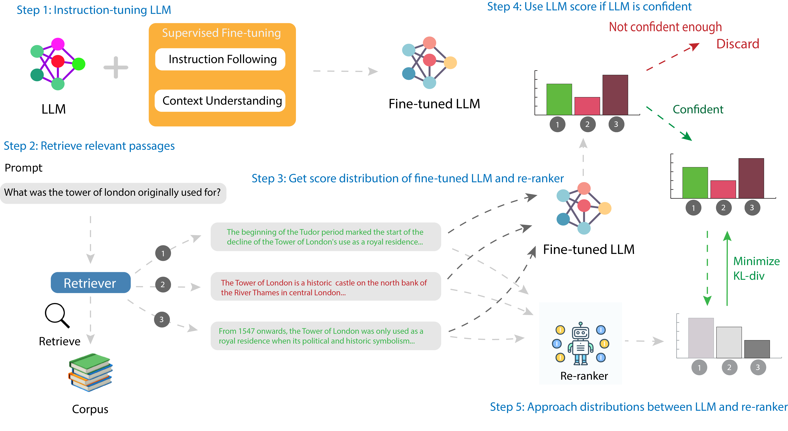

# RAG-LER: Ranking Adapted Generation with Language-Model Enabled Regulation

This repo includes the implementation of our paper **RAG-LER: Ranking Adapted Generation with Language-Model Enabled Regulation**.



## Introduction

We introduce **RAG-LER**, a novel framework that enhances an LM’s context understanding and improves the quality and accuracy of provided passages through an LM-supervised re-ranker. **RAG-LER** fine-tunes a pre-trained LM to follow instructions and discriminately use provided information. It then leverages this fine-tuned LM to generate ranking scores, which serve as supervised labels for training the re-ranker.

## Update (Dec 28th, 2024)

- We have updated our re-ranker training method which incorporates a reference model during training.
- We immigrated our experiment recording from [mlflow](https://mlflow.org) to [wandb](https://wandb.ai). Both are wonderful tools for experimental tracking.
- We addressed some dependency issues mainly on retrieval.

## Table of Contents

- [Introduction](#introduction)
- [Installation](#installation)
- [Training](#training)
- [Retrieval](#retrieval)
- [Evaluation](#evaluation)
- [Contributing](#contributing)
- [Citation](#citation)

<!-- Add Citation -->

## Installation

Installation can be done by running the command:

```bash
# Clone the repo
git clone https://github.com/notoookay/rag-ler.git

cd rag-ler
source setup.sh
```

We use [wandb](https://wandb.ai) for our experiment recording.

## Training

Our training data can be downloaded at [HuggingFace](https://huggingface.co/datasets/notoookay/rag-ler_train_data). The training datasets can be found in the `data` directory.

Our training data includes datasets for training LLM and re-ranker. See our paper for details of data processing.

### LM training

The LM training data can be found in `llm_train.jsonl`. We include a set of instruction-tuning datasets and open-domain QA datasets for improving the capability of Instruction-following and Reading Comprehension.

To fine-tune an LLM under same configuration described in paper, you can directly run the fine-tuning scripts.

```bash
bash ./scripts/finetune_llm.sh
```

**Note:** please check and modify the data path in the script (same for the scripts below).

Feel free to modify the settings in this script for custom test.

Our [7B](https://huggingface.co/notoookay/ragler-llama2-7b) and [13B](https://huggingface.co/notoookay/ragler-llama2-13b) models are available on HuggingFace in case you want to use directly.

For quick start, you can use trained LM:

```python
from transformers import AutoTokenizer, AutoModelForCausalLM
import torch

tokenizer = AutoTokenizer.from_pretrained("notoookay/ragler-llama2-7b")
model = AutoModelForCausalLM.from_pretrained("notoookay/ragler-llama2-7b", torch_dtype=torch.bfloat16, device_map="auto")

# Example usage
input_text = "### Instruction:\nAnswer the following question.\n\n### Input:\nQuestion:\nWhat is the capital of France?\n\n### Response:\n"
inputs = tokenizer(input_text, return_tensors="pt")
outputs = model.generate(**inputs, max_new_tokens=100)
print(tokenizer.decode(outputs[0]))
```

### Re-ranker training

The re-ranker training data can be found in `reranker_train.jsonl`. It includes [Natural Questions](https://ai.google.com/research/NaturalQuestions) and [HotpotQA](https://hotpotqa.github.io/index.html) for single-hop and multi-hop Question Answering. It already includes the retreived passages from Dec 2018 wikidump using Contriever MS-MARCO. In case you need to retrieve by yourself, you can download the corpus from [Contriever](https://github.com/facebookresearch/contriever) by running:

```bash
# Download Dec 2018 corpus
wget https://dl.fbaipublicfiles.com/dpr/wikipedia_split/psgs_w100.tsv.gz

# Download corresponding embeddings
wget https://dl.fbaipublicfiles.com/contriever/embeddings/contriever-msmarco/wikipedia_embeddings.tar
```

As re-ranker training is supervised by LM, we need to get training label (probabilities) from LM, you can get labels from LM by running:

```bash
bash ./scripts/prepare_reranker_train_data.sh
```

In addition to Llama2 family models, we also trained [Mistral-7b](https://huggingface.co/mistralai/Mistral-7B-v0.3) model, which uses less memory (about 40GB), so you may reduce inference cost when testing on Mistral model.

We inference our fine-tuned LLMs using the same configuration in the script above. After you get the labels, the re-ranker can be trained by running:

```bash
bash ./scripts/finetune_reranker.sh
```

## Retrieval

In default, we use Contriever-MS MARCO as our retriever. We use Dec 2018 wiki dump mentioned above for our evaluation. We use Dec 2020 for PopQA. For corpus downloading, please refer to [Atlas corpus download guide](https://github.com/facebookresearch/atlas?tab=readme-ov-file#corpora).

### Sparse retrieval

You can retrieve with sparse retriever (e.g. BM25). We use [pyserini](https://github.com/castorini/pyserini/tree/master) for our BM25 retrieval.

Before retrieval, you need to build BM25 index for the corpus. Please check [this](https://github.com/castorini/pyserini/blob/master/docs/usage-index.md#building-a-bm25-index-direct-java-implementation) for building BM25 index of the corpus. After building the index, you can retrieve by running:

```bash
bash ./scripts/passage_retrieval_bm25.sh
```

We split the sparse and dense retrieval for clarity.

### Dense retrieval

For dense retrieval (e.g. Contriever), you need to generate the embeddings of both your input data and corpus. To build dense embedding, you can run:

```bash
python retrieval/generate_passage_embeddings.py \
  --model_name_or_path facebook/contriever-msmarco \
  --output_dir embeddings/enwiki-dec2021 \
  --passages corpora/wiki/enwiki-dec2021/text-list-100-sec.jsonl \
  --shard_id 0 --num_shards 1

# Or using script directly
bash ./scripts/generate_passage_embeddings.sh
```

After generating the embeddings, you can retrieve by running:

```bash
bash ./scripts/passage_retrieval.sh
```

We use [FAISS](https://github.com/facebookresearch/faiss) for our similarity search of dense vectors. We recommend using faiss-gpu for fast search, which costs about 110GB GPU memory for Dec 2020 wikidump.

## Evaluation

We evaluate on a set of knowledge-intensive tasks including open-doamin QA and fact checking.

In addition to knowledge-intensive tasks, we also include several commonsense-reasoning evaluations, which typically do not need retrieval.

You can evaluate by running:

```bash
bash ./scripts/run_llm.sh
```

**Note:** Remember to modify the arguments you use, for more specific details of arguments, please refer to our paper.

## Citation

Coming soon.

## Contributing

We welcome contributions from the community! Whether it's fixing bugs, adding new features, improving documentation, or providing feedback, your help is invaluable.
